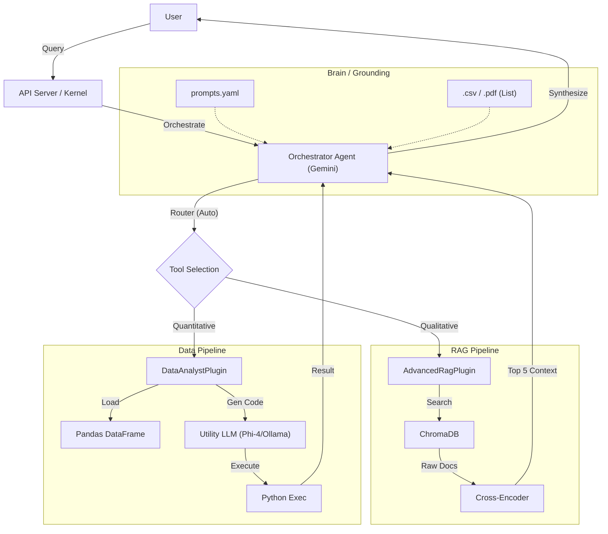

# Semantic Hybrid Agent 🤖

A production-ready **Hybrid AI Agent** that intelligently combines **Retrieval-Augmented Generation (RAG)** for unstructured text and a **Pandas Code Interpreter** for structured data analysis.

It doesn't just "search" or "calculate"—it **thinks, routes, and talks**.

## 💡 Tech Stack?

### 1. **Semantic Kernel (The Framework)**
We chose **Microsoft Semantic Kernel** because:
- **First-Class Function Calling**: It treats "Tools" as native plugins, allowing the LLM to autonomously orchestrate complex multi-step workflows.
- **Enterprise Ready**: Designed for reliability, observability, and strict type safety.
- **Connector Agnostic**: We can swap the backend Brain (e.g., from OpenAI to Gemini to Ollama) with zero code changes to the agent logic.

### 2. **ChromaDB (The Memory)**
- **Why**: It matches our "Local-First" design philosophy. It runs embedded (no Docker required for dev), is extremely fast, and handles metadata filtering natively.

### 3. **Cross-Encoders (The Quality Filter)**
- **Problem**: Vector search is "fuzzy" and often retrieves irrelevant text.
- **Solution**: We implemented a Re-ranking pipeline using `ms-marco-MiniLM-L-6-v2`. This "Second Brain" reads the top 25 results and ranks them by *true meaning*, ensuring the Agent only sees high-quality data.

## 🌟 Key Features

### 🧠 Autonomous Intelligence (The "Brain")
The agent utilizes **LLM-based Automatic Function Calling** to intelligently select the right tool for the job:
1.  **Semantic Search (RAG)**: For qualitative inquiries (e.g., "Summarize the mentorship program") -> Uses **ChromaDB** & **PDFs**.
2.  **Conversational Data Analysis**: For quantitative inquiries (e.g., "What is the average price?") -> Uses **Pandas** & **CSVs** via a **Synthesis Loop**.
3.  **Multi-Step Reasoning**: Capable of combining tools to answer complex compound questions ("Check the PDF for the policy and then query the CSV for the financial impact").

### 🚀 Advanced Capabilities
- **Precision Re-ranking**: Integrates a `Cross-Encoder` to re-rank vector search results, significantly boosting retrieval accuracy.
- **Conversational Code Interpreter**:
    - **Action**: Writes and executes Python code on the fly to query CSV datasets.
    - **Observation**: Captures the raw execution result (e.g., `5400`).
    - **Synthesis**: Transforms the raw number into a natural, context-aware sentence ("The total revenue constitutes $5,400.").

## 🧠 How to Ground the Agent (Configuration)
The agent's "Brain" is defined in `config/prompts.yaml`. To make it an expert on **your** specific data:

1. Open `config/prompts.yaml`.
2. Edit the `tool_chat_system` block.
3. **Give it an Identity**: Change "You are an intelligent assistant" to "You are the HR Policy Expert".
4. **Set Default Context**: Add rules like "If user asks for 'the report', assume they mean 'Q3_Financials.pdf'".

This prevents the agent from asking "Which report?" and makes it act like a domain expert immediately.

## � Architecture Status



## 🛡️ Safety & Grounding
This agent is engineered for **Enterprise Safety**:
1.  **File Access Safety**: The agent is strictly forbidden (via `prompts.yaml` and system rules) from attempting `open()` operations on arbitrary files. It *must* use the RAG tool for reading docs.
2.  **No Hallucinations**: Prompt Engineering enforces that "If the answer is not in the context, say 'I don't know'."
3.  **Strict Persona**: Configurable in `config/prompts.yaml` (e.g., "You are an Economic Index Specialist").

## ⚙️ Configuration (Multi-LLM)
You can assign different models to different roles in `config/settings.yaml` to optimize for cost/performance:
```yaml
llm:
  agent:
    service: "gemini"    # Smartest Model for Orchestration
    model_id: "gemini-pro"
  tools:
    service: "ollama"    # Faster/Cheaper Model for Code Gen
    model_id: "phi4"
```

## �📂 Project Structure

```text
semantic-rag-agent/
├── config/
│   ├── settings.yaml          # LLM Configs (Ollama/Gemini), Paths
│   └── prompts.yaml           # Centralized System Prompts & Logic
├── data/
│   ├── inputs/                # DROP PDF (for RAG) AND CSV (for Analysis) FILES HERE
│   └── chroma_db/             # Auto-generated Vector Database
├── src/
│   ├── core/
│   │   ├── agent.py           # Main Autonomous Agent
│   │   ├── kernel.py          # Semantic Kernel Setup
│   │   ├── ranker.py          # Cross-Encoder Re-ranker Service
│   │   ├── models.py          # Vector DB Schema
│   │   └── config.py          # configuration loader
│   ├── loaders/
│   │   └── file_loader.py     # PDF Extraction Logic
│   ├── plugins/
│   │   ├── rag_plugin.py      # Semantic Search Plugin (for PDFs)
│   │   └── data_plugin.py     # Data Analyst Plugin (for CSVs)
│   └── utils/
│       └── prompt_manager.py  # Prompt Management Utility
├── api.py                     # FastAPI Backend
├── ingest.py                  # Data Ingestion Script (PDFs only)
├── index.html                 # Chat Interface
├── requirements.txt
└── .env                       # API Keys (e.g., GEMINI_API_KEY)
```

## ⚡ Setup & Usage

### 1. Installation
Clone the repository and install dependencies:
```bash
pip install -r requirements.txt
```

### 2. Configuration
- **LLM Settings**: Edit `config/settings.yaml` to switch between Ollama (local) or Google Gemini (cloud).
- **API Keys**: If using Gemini, create a `.env` file:
  ```bash
  GEMINI_API_KEY=your_api_key_here
  ```

### 3. Ingest Data
Drop your documents into `data/inputs/`:
- **PDFs**: Will be indexed for search.
- **CSVs**: Will be loaded for data analysis.

Run the ingestion script:
```bash
python ingest.py
```
*Note: This script strictly processes `.pdf` files for the Vector DB. `.csv` files are read live by the agent.*

### 4. Run the Agent
Start the FastAPI server:
```bash
python api.py
```

### 5. Chat
Open `index.html` in your web browser. 

**Try these workflows:**
- **RAG**: *"Summarize the PDF document"* -> Agent searches Vector DB -> Returns citation-backed answer.
- **Analysis**: *"Calculate the average revenue"* -> Agent writes Python code -> Calculates result -> Synthesizes conversational answer.
- **Chitchat**: *"Hi there"* -> Agent responds politely.

## 🔧 Troubleshooting
- **Port 8000 in use**: Kill the existing process: `lsof -t -i:8000 | xargs kill -9`.
- **Model Download**: The first run might take a minute to download the embedding models (`nomic-embed-text`) and re-ranking models.
